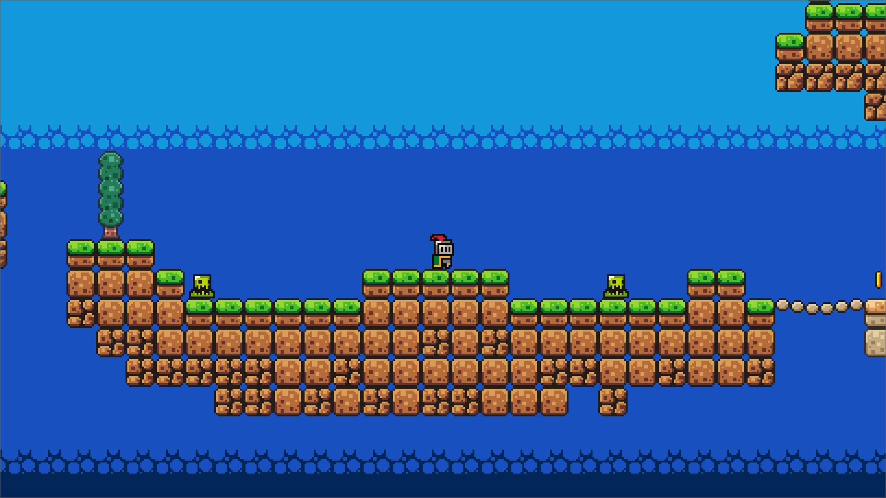

# Godot 2D Platformer Practice Game

This repository contains a 2D platformer game built with GDScript and Godot Engine by following  [Brackeys' Godot Beginner Tutorial.](https://www.youtube.com/watch?v=LOhfqjmasi0)

_Made and Tested with **Godot 4.4.1**_

## Screenshots

*Game start screen*

---

*Encounter with a slime enemy*

---
