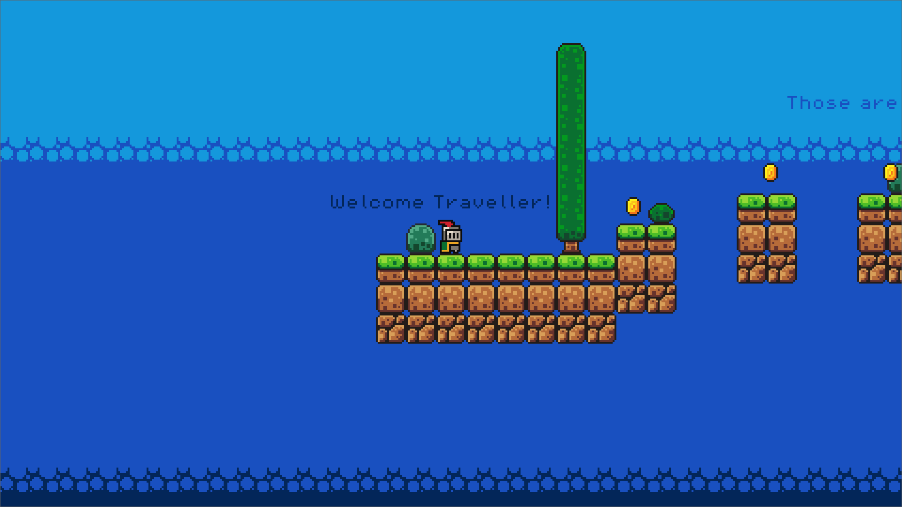
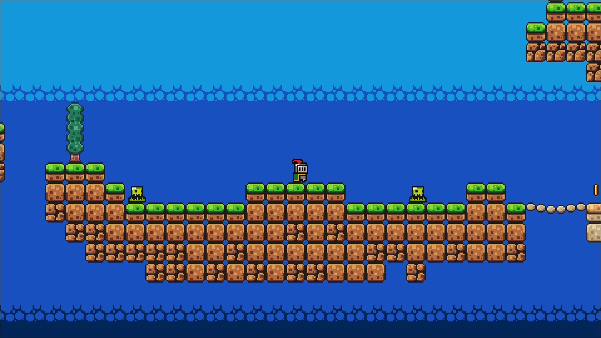

# 2D Platformer Practice Game

_Made and Tested with **Godot 4.4.1**_

---

- This repository contains a complete 2D platformer game project built with GDScript and Godot Engine. 

- The project was created as a practice and learning exercise to explore Godot fundamentals.

- This project was created by following the [Brackeys' Godot Beginner Tutorial](https://www.youtube.com/watch?v=LOhfqjmasi0) Special thanks to Brackeys for providing clear and helpful guidance for beginners.

## Learning Goals
This project was developed to:
- Learn Godot fundamentals
- Practice Godot's scene and node system
- Learn GDScript and its scripting patterns
- Implement common platformer mechanics

## Screenshots

*Game start screen*

---

*Encounter with a slime enemy*

---
